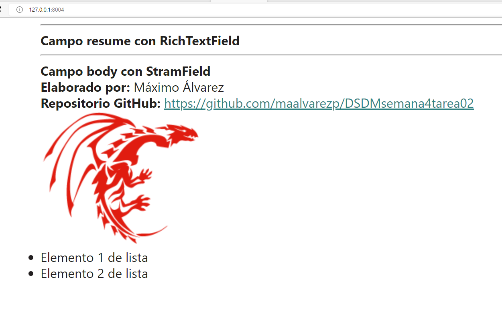
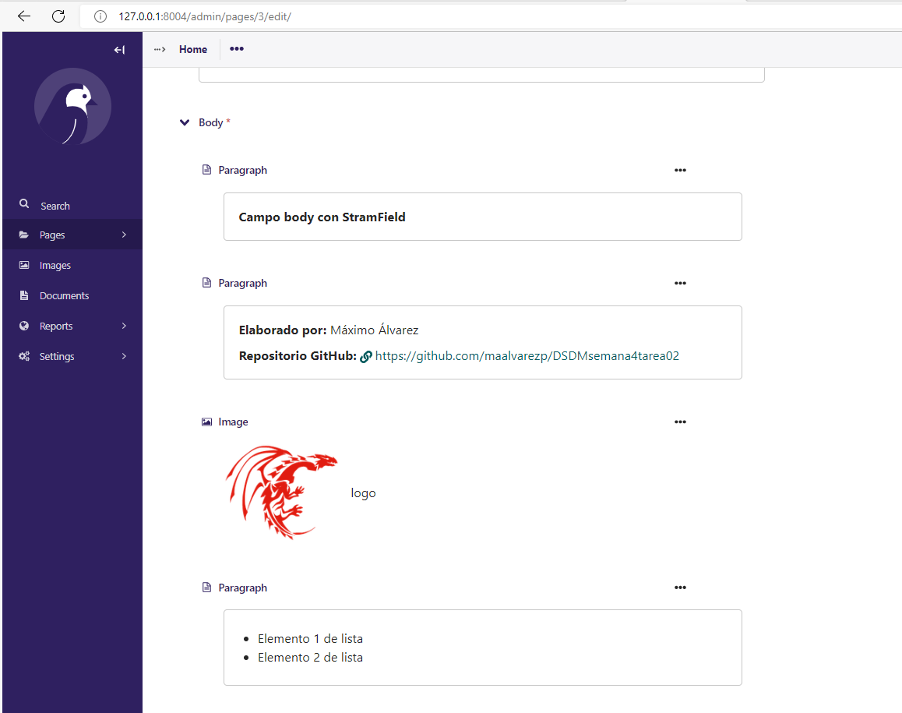

# DSDMsemana4tarea02

**Elaborado por:** Máximo Álvarez

Se empleo el cms https://wagtail.org/, que está basado en django, y se leyó la doucmentación (https://docs.wagtail.org/en/v4.0.4/getting_started/tutorial.html y https://docs.wagtail.org/en/v4.0.4/topics/streamfield.html) para poder realizar las pruebas de los componentes y ver nuevos cambios en el front del proyecto.

> **Sitio público**

> **Sitio de administración**

